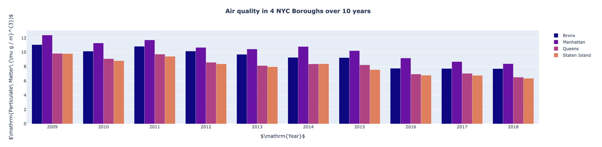

# NYC-Trees
A CS 2316 project analyzing tree data, air quality data, and lung cancer data in the 5 boroughs of NYC. Collaborative project with Ishani Spanier (isspanier@gmail.com)

To view the results of the project, view the file **PhaseIII.ipynb**.
To view data visualizations, the code must be run locally.

Alternatively, view static snapshots of the interactive visualizations below:

### Choropleth of tree density (trees / mi^2) with breakdown of species
(Note: Species breakdown only accessible in interactive version)

### Air quality in 4 NYC Boroughs over 10 years (Particulate Matter: micrograms/ cubic meter)

### Cancer v. Trees Correlation 

